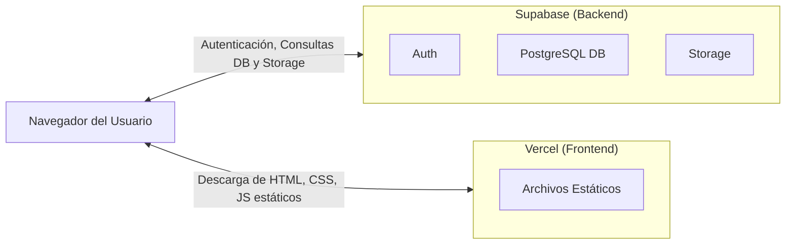

# 🏗️ Guía de Configuración — Backend Real con Supabase

Bienvenido a la guía de configuración del backend de UNDR utilizando Supabase. Sigue estos pasos cuidadosamente para conectar tu aplicación con una base de datos en producción real.

## Paso 1: Crear Proyecto en Supabase

1. Ve a [supabase.com](https://supabase.com) y crea una cuenta gratuita.
2. Crea un nuevo proyecto (puedes nombrarlo `undr`).
3. Elige una contraseña segura para la base de datos.
4. Selecciona la región más cercana a tus usuarios objetivo (se recomienda *US East*).
5. Espera unos minutos a que el proyecto se aprovisione completamente.

> [!TIP]
> Guarda la contraseña de tu base de datos en un lugar seguro (como un gestor de contraseñas), la necesitarás si quieres conectar herramientas externas directamente a la base de datos PostgreSQL.

## Paso 2: Configurar la Base de Datos

1. Ve a la sección **SQL Editor** en el panel de Supabase.
2. Copia y pega el contenido del archivo `database/schema.sql`.
3. Haz clic en **'Run'** para ejecutarlo. Esto creará todas las tablas, índices, triggers y políticas RLS (Row Level Security).
4. Luego, ejecuta el contenido de `database/seed.sql` para rellenar la base de datos con datos de demostración.

> [!IMPORTANT]
> Es crucial ejecutar el esquema antes de los datos de semilla, de lo contrario, la inserción de datos fallará porque las tablas no existen.

## Paso 3: Obtener las Credenciales

1. Ve a **Settings > API** en el panel de Supabase.
2. Copia la URL del proyecto bajo **'Project URL'** (esto será tu `SUPABASE_URL`).
3. Copia la clave pública bajo **'anon public'** (esto será tu `SUPABASE_ANON_KEY`).
4. Abre tu archivo local `js/supabase-config.js` y reemplaza los valores de ejemplo por estas credenciales reales.

> [!WARNING]
> Nunca compartas la clave `service_role` (secret) públicamente ni la incluyas en tu código frontend. Solo debe usarse en entornos de servidor seguros.

## Paso 4: Configurar Auth

1. Ve a **Authentication > Providers**.
2. Asegúrate de que el proveedor de **Email** esté habilitado (normalmente lo está por defecto).
3. *(Opcional)* Configura otros proveedores como Google OAuth o Apple OAuth si lo deseas.
4. Ve a **URL Configuration**.
5. Configura la **Site URL** con la URL de tu despliegue en Vercel (ej. `https://undr.vercel.app`).
6. Añade URLs de redirección (Redirect URLs) adicionales si tienes otros dominios.

## Paso 5: Configurar Storage (para imágenes)

1. Ve a **Storage** en el panel de Supabase.
2. Crea un bucket llamado `product-images` y asegúrate de marcarlo como **público**.
3. Crea un bucket llamado `avatars` y asegúrate de marcarlo como **público**.
4. Crea un bucket llamado `kyc-documents` y déjalo como **privado**.
5. Crea un bucket llamado `ppv-content` y déjalo como **privado**.
6. Configura las políticas de almacenamiento (Storage Policies) para cada bucket según quién deba poder leer o subir archivos.

## Paso 6: Verificar que Todo Funciona

1. Abre tu aplicación localmente o en Vercel.
2. Abre la consola de herramientas de desarrollo (DevTools) de tu navegador.
3. Verifica que no haya errores de conexión con Supabase.
4. Intenta registrar un nuevo usuario de prueba.
5. Ve al panel de Supabase y revisa si el usuario fue creado exitosamente en **Authentication > Users**.

## Paso 7: Desplegar en Vercel

No se necesitan cambios significativos en tu código para el despliegue. Vercel servirá tus archivos estáticos de forma global y rápida.
El cliente de Supabase se conecta directamente desde el navegador del usuario hacia los servidores de Supabase de manera segura utilizando las políticas RLS.

> [!NOTE]
> En producción, es altamente recomendable usar variables de entorno de Vercel en lugar de codificar directamente las credenciales en tus archivos `.js`, o tener un paso de compilación que inyecte las variables de entorno para mayor seguridad y flexibilidad entre entornos.

## Costos Estimados

- **Nivel Gratuito (Free tier):** Ideal para empezar. Incluye 500MB de base de datos, 1GB de almacenamiento de archivos, 2GB de ancho de banda y hasta 50,000 usuarios activos mensuales.
- **Nivel Pro ($25/mes):** Para proyectos en crecimiento o en producción estable. Incluye 8GB de base de datos, 100GB de almacenamiento de archivos, y 250GB de ancho de banda.

## Troubleshooting Común

- **Errores CORS (Cross-Origin Resource Sharing):** Asegúrate de que tu dominio de producción esté en la lista de orígenes permitidos en la configuración de API de Supabase o Auth.
- **Errores RLS (Row Level Security):** Si los datos no aparecen, verifica que las políticas estén aplicadas correctamente y que tu usuario autenticado tenga permisos para leer/escribir.
- **Errores Auth:** Verifica la configuración de confirmación de correo electrónico. Si la confirmación de email está habilitada en Supabase, los usuarios no podrán iniciar sesión hasta que hagan clic en el enlace del correo.

## Arquitectura Final

A continuación se muestra un diagrama de cómo funciona la arquitectura de la aplicación UNDR utilizando Vercel y Supabase:

